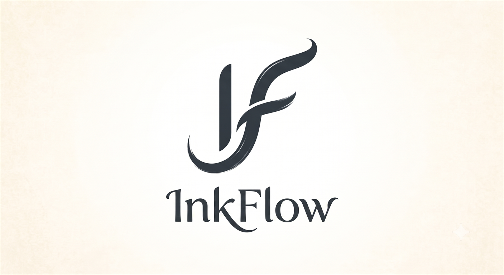

<p align="center">
  
</p>

# InkFlow

InkFlow 是一款面向 Windows 的本地优先 Markdown 编辑器：界面克制、写作专注，同时把 Markdown 源码作为唯一事实来源。

当前版本：`0.1.3`（Windows x64 v1）。项目不包含账号、遥测、后台联网、云同步、AI、插件系统或 Git 操作。

## 已实现

- Tauri 2 + Rust + WebView2 桌面外壳，保留 Windows 原生窗口边框、缩放与 Snap。
- Svelte 5 + CodeMirror 6 编辑器，支持实时融合、源码和只读预览三种模式；活动文档以 CodeMirror 持久 `Text` 结构保存，普通输入不再逐键生成全文字符串，保存、恢复、预览、导出和后台分析才按文档版本共享一次序列化结果；切换标签或预览模式后保留各文档撤销历史，隐藏标签只缓存选择与历史而不复制完整正文。
- 光标离开后渲染标题、强调、行内代码、任务框、图片、行内/块公式、表格、代码围栏和 Mermaid；点击复杂块回到原始 Markdown。
- 表格悬浮命令支持增加/删除行列；选区工具条、`/` 块命令和统一命令面板。
- 多标签页、文件树、大纲、文档查找、工作区全文搜索、快速打开和字数统计。
- UTF-8、UTF-8 BOM、带 BOM 的 UTF-16 LE/BE 与常见 Windows 旧编码识别；保留换行符、BOM 和末尾换行，CLI 拒绝生成无法可靠回读的无 BOM UTF-16 文件。
- 750ms 自动保存、按文档串行保存、同目录临时文件 + 刷盘 + 原子替换、提交瞬间的被替换版本核验、低开销外部修改检测、并排版本比较和恢复中心；外部版本不符时原子恢复并进入冲突流程，另存为期间新出现或变化的目标也不会被静默覆盖，保存或后台重载期间的新输入不会被旧响应覆盖；成功核验后的 Windows 备份会标记为可清理文件，短暂占用时由后台重试；首次保存、另存为和已有文件替换均使用固定长度的目标名哈希和 UUID，长文件名不会因内部后缀超出 NTFS 单组件限制；清理器只识别完整的 16 位小写十六进制目标哈希、操作标记和 UUID，进程崩溃遗留的写入临时文件还必须超过安全时限，每个目录最多每小时统一扫描一次，并在一次枚举中处理其中所有文档的 InkFlow 临时文件。
- 图片粘贴/拖放在读取前检查 50MB 上限，并使用文档级异步占位符；新资源以完整内容哈希稳定命名，使 CLI 预演与真实提交得到同一路径，同时支持内容哈希去重、未命名文档临时资源迁移，以及“另存为”时复制 Markdown、引用式、HTML `img/src` 和响应式 `source/srcset` / `img/srcset` 本地图片；这些图片目标按 CommonMark/HTML 语义解码字符引用后定位源文件。未命名图片写入、已完成资源的首次保存迁移和对应临时文件清理使用同一跨进程锁，仍在上传或未被当前 Markdown 引用的资源会保留给后续保存，不会被并发保存误删；没有待迁移引用的普通保存不争用恢复区锁。桌面与 CLI 文档写入、已保存文档的资源写入及工作区创建、重命名、回收站移动共享短时路径变更锁；同一 `.assets` 命名空间的资源写入还与另存为事务串行化。锁会保持到文档最终修订及桌面后端路径状态更新完成，避免成功写入后路径被移动而报告失败，也避免强制写入在旧位置重新创建文件；桌面重命名会在锁内同步后端文档路径。失败时回滚本事务新建资源，不会因桌面端与 CLI 并发操作丢失或断开资源；生成的 Markdown 资源路径会把文件名中的字面 `%`、`&` 分别写为 `%25`、`%26`，与预览侧单次 URL 解码保持对称，同时兼容旧版已经写入的字面 `%xx` 资源目录；写回原始 HTML 属性时还会保留其引号上下文，并编码可能破坏属性边界的空白或定界字符；即使原 Markdown 已被外部删除，当前编辑缓冲区仍可另存为。
- 自包含 HTML 导出（内嵌普通、响应式及 Mermaid SVG 中的本地图片，并仅在含公式时加入 KaTeX 样式和字体）；Windows WebView2 `PrintToPdf` PDF 导出先写入系统临时目录中的每任务私有目录，该目录的身份句柄会保持到正常完成或迟到回调实际结束，再条件原子替换目标文件。正常、失败及迟到回调会删除该目录；应用异常终止后，下一次导出只清理超过 24 小时且名称严格匹配 InkFlow UUID 规则的非重解析目录。桌面端在保存对话框返回后立即以同一次路径快照记录规范路径、目标类型、父目录身份及现有文件修订，并以 10 分钟有效的一次性令牌授权最终提交；渲染期间发生修改、创建、移动、删除、类型变化或父目录替换时拒绝覆盖并要求重新选择，耗时渲染不会先向已重绑定的目标目录写入临时文件。每个窗口只运行一个不可变快照导出任务；任务在任何异步等待前冻结正文、文档路径和工作区根，后端捕获资源作用域前后都会核对该快照，因此并发另存为或工作区切换只会中止任务，不会把旧正文与新目录中的图片混合。任务同时冻结恢复资源根及相关目录身份，并在 Recovery 锁内记录该未保存文档全部待迁移图片的文件修订；资源加载会先持有已冻结的目录身份，再通过该规范 Recovery 路径获取锁并复核文件修订，因此目录被替换或并发保存迁移图片时会终止旧快照导出，而不会向替代目录写入锁文件或静默生成缺图文件。该作用域作为显式释放的有界租约不会在保存对话框中途过期，因此关闭标签、另存为或切换工作区不会让导出改读其他资源；原目录被移动或同名替换同样会使作用域失效。交互预览不会取消导出的独立 Markdown Worker；Mermaid 在专用同源 iframe 的独立 JavaScript realm 内按 InkFlow 队列和 Mermaid 自身队列串行渲染，隔离预览、融合和导出的主题、解析器状态与字体配置；交互任务在排队阶段和 iframe 就绪后都会复核是否过期，已淘汰任务不会占用 30 秒渲染槽位。单次 Mermaid 渲染最多等待 30 秒；超时后调用方降级保留源码，并销毁包含挂起 Promise 的整个 iframe realm，下一任务使用全新实例，因此既不会与旧渲染重叠，也不会永久禁用后续图表。片段、HTML 与 PDF 的最终写入共享短时路径变更锁，耗时渲染仍在锁外进行。
- 简体中文和英文界面、系统/浅色/深色主题、专注模式、打字机模式、高对比度与减少动态效果适配。
- 首次空白文档提供可立即消失的极简入口；命令面板、搜索、斜杠菜单和弹窗支持完整键盘与焦点恢复操作，输入法组合期间不会提前筛选命令。多标签支持横向滚动、活动项自动显露和标签列表。
- 正常启动异步恢复上次工作区、标签顺序、活动文档及编辑模式；显式双击 Markdown 文件时优先打开指定文件，CLI 指定的工作区则通过独立启动通道打开，不会被当作文档；初始化期间收到的多次文件/工作区请求按到达顺序处理，不会合并或覆盖。会话仅保存路径和模式，未保存内容仍由恢复中心负责。
- 独立 `inkflow-cli.exe` 为 Agent 和脚本提供文档读取/分析/事务编辑、工作区搜索、图片、恢复、设置、会话、安全渲染与导出；公共 JSON 契约为 `inkflow.cli/v1`，支持 Schema 自发现、JSONL 即时流式搜索、可安全截断的 stdout 管道、修订冲突退出码、完整校验型 `--dry-run`、`--root` 和隔离数据目录。
- NSIS 安装配置、Markdown 文件关联、WebView2 Evergreen 引导程序和便携 ZIP 脚本；安装包和便携包同时携带桌面端与 CLI。

Markdown 语法边界见 [docs/markdown-compatibility.md](docs/markdown-compatibility.md)，CLI 使用说明见 [docs/cli.md](docs/cli.md)，桌面 IPC 契约见 [backend-api.md](backend-api.md)。

## 快捷键

| 快捷键 | 功能 |
|---|---|
| `Ctrl+N` | 新建文档 |
| `Ctrl+O` | 打开 Markdown 文件 |
| `Ctrl+S` | 立即保存 |
| `Ctrl+Shift+S` | 另存为 |
| `Ctrl+P` | 快速打开工作区/最近文件 |
| `Ctrl+Shift+P` | 命令面板 |
| `Ctrl+F` | 文档内查找替换 |
| `Ctrl+Shift+F` | 搜索工作区 |
| `Ctrl+B` / `Ctrl+I` | 加粗 / 斜体 |
| `Ctrl+K` | 插入链接 |
| `F11` | 专注模式 |

## 本地开发

前置条件：Windows 10/11、Node.js 22、pnpm 10、Rust stable、Microsoft C++ Build Tools，以及 WebView2 Evergreen Runtime。

```powershell
pnpm install
pnpm tauri:dev
```

浏览器内只验证前端布局可运行 `pnpm dev`；文件、导出、回收站等能力仅在 Tauri 桌面进程中开放。

完整验证：

```powershell
pnpm verify
```

该命令会重新生成 Rust → TypeScript IPC 类型，然后依次执行 Svelte 类型检查、前端测试、Rust 格式检查、Rust 测试和生产构建。

项目根目录的 `logo.png` 是 InkFlow 唯一的正式品牌 Logo，README 直接展示该原图。Windows 桌面图标也由这张图片生成；由于系统图标必须为正方形，`pnpm icons:windows` 只会对原图做居中正方形裁切，再生成 Windows 所需的 PNG、Square/Store Logo 和 `icon.ico`，不会重绘、改色或拉伸，也不会改动 Android、iOS 或 macOS 图标。`pnpm verify` 会检查原图尺寸、README 引用、Windows 图标尺寸及生成结果是否漂移，实际尺寸预览见 `docs/brand/icon-size-preview.html`。

CLI 开发与契约检查：

```powershell
pnpm cli:test
pnpm cli:schema
pnpm cli:build
src-tauri\binaries\inkflow-cli-x86_64-pc-windows-msvc.exe capabilities --format json
```

`pnpm verify` 已包含 CLI 单元/真实二进制契约测试和生成 Schema 漂移检查。`pnpm cli:build` 生成 Tauri 所需的目标三元组 sidecar；产物目录已忽略，不应提交二进制。

生成 5MB/10 万行长文夹具并测量 Windows 原生窗口创建、编辑器可交互时间和空闲总工作集：

```powershell
pnpm perf:fixture
pnpm tauri build --no-bundle
pnpm perf:windows
pnpm perf:cli
```

设置 `VITE_INKFLOW_PERF=1` 后运行开发版本，可通过 `window.__INKFLOW_PERFORMANCE__` 读取输入延迟分位数并采样滚动帧率；数据只保留在当前 WebView，不写盘、不联网。

`perf:windows` 会先确认没有其他 InkFlow 实例正在运行，并为被测进程创建一次性的独立应用数据目录；脚本等待编辑器挂载后产生的就绪标记和目标文档标题，不把提前创建的空白 HWND 当作可输入首屏。空闲工作集统计 InkFlow 与 WebView2 子进程组成的完整进程树，并等待 CPU 与内存连续稳定后采样。性能夹具、最近文件、会话和恢复记录不会写入日常使用的数据目录，测试结束后该临时目录会被删除。

`perf:cli` 以真实发布二进制重复测量非渲染冷启动、5MB/10 万行读取与分析，以及可用时的隐藏 WebView2 渲染 p95；报告只写入 `src-tauri/target/cli-performance.json`，不会上传遥测。hosted runner 数据不作为发布性能基线。

## 构建与发布

生成 Windows x64 NSIS 安装包：

```powershell
pnpm tauri:build
```

生成便携 ZIP：

```powershell
pnpm tauri build --no-bundle
pnpm portable
```

`pnpm portable` 会先重新构建当前源码对应的 CLI sidecar，避免干净仓库缺少二进制或把旧 CLI 打入新包。便携包写入项目内的 `release/`，文件名中的版本从 `src-tauri/tauri.conf.json` 读取，不再由脚本硬编码。NSIS 和便携 ZIP 均包含 `InkFlow.exe` 与 `inkflow-cli.exe`；隐藏渲染依赖前者，因此不单独发布残缺 CLI 包。交互式安装结束时可选择把安装目录加入当前用户 PATH，默认否，静默安装不修改 PATH；安装和卸载通过动态注册表读取保留长 PATH、原值类型及其他条目，避免受 NSIS 固定字符串长度影响而截断。卸载时仅在安装目录项唯一可辨认时移除；如果用户或其他工具又添加了同值项，安装器会保留全部重复项并提示手动处理，避免误删不属于 InkFlow 的配置。公开发布前仍需使用可信代码签名证书对两个可执行文件和安装包签名。

### GitHub 自动化

`CI` 工作流会在 `master` 推送、面向 `master` 的 Pull Request 和手动运行时，于 Windows Server 2022 执行冻结依赖安装、`pnpm verify` 以及 Rust → TypeScript 绑定漂移检查。当前暂不把该检查设为 `master` 的强制分支规则，待连续运行稳定后再启用。

`Release` 工作流只接受 `vX.Y.Z` 稳定标签，并要求以下四处版本完全一致：

- `package.json`
- `src-tauri/tauri.conf.json`
- `src-tauri/Cargo.toml`
- `src-tauri/Cargo.lock` 中的 `inkflow` 包

每个版本还必须提交 `docs/releases/vX.Y.Z.md`，并包含 `## 更新` 与 `## 修复`。可复制 [发布说明模板](docs/releases/TEMPLATE.md) 后编辑。发布前可在 GitHub Actions 的 `Release` 工作流中手动输入现有标签进行 dry-run；该模式始终检出并构建指定标签。为兼容早于工作流创建的标签，当前 `master` 仅提供发布工具和回填说明，不会替换标签源码。dry-run 只生成保留 7 天的构建产物，不创建或修改 GitHub Release。

发布流程：

```powershell
# 1. 更新四处版本并编写 docs/releases/vX.Y.Z.md
pnpm release:validate -- --tag vX.Y.Z
pnpm verify

# 2. 提交并推送版本变更后创建标签
git tag vX.Y.Z
git push origin vX.Y.Z
```

标签工作流会先构建目标三元组对应的 CLI sidecar，再执行 Tauri 打包，最终生成 NSIS 安装包、同时包含两个程序的便携 ZIP、`SHA256SUMS.txt` 和带哈希的说明，然后创建或更新草稿 Release。已有公开 Release 永远不会被工作流覆盖；检查安装包和说明无误后，需要在 GitHub 页面人工公开草稿。工作流暂不配置代码签名 Secret，因此说明中会保留 SmartScreen 安全提醒。

生产构建使用共享的 ES Module Worker；字数统计、大纲生成和远程图片检测在停止输入 300ms 后统一调度，Markdown 渲染同样离开输入主线程。没有图片语法候选的文档会在 Worker 内直接返回，其余文档复用同一套净化渲染管线，并且不会重复打包解析依赖。同类型新请求会终止仍在执行的旧 Worker 任务，另一类型的有效请求会在重建后的 Worker 中自动重放，避免过期全文解析积压；Worker 不可用时仅允许小文档降级到主线程分析，大文档保留轻量统计并跳过全文分析，避免冻结写作界面。原始 HTML、KaTeX、Mermaid 和代码围栏语言包按内容懒加载。发布产物不携带源码映射；首屏编辑代码与大型可选渲染依赖保持在不同分包中。

## 数据位置与安全边界

- 设置和恢复数据位于 `%LOCALAPPDATA%\InkFlow\InkFlow\data`（具体根目录由 Windows Known Folder API 决定）。
- 桌面端与 CLI 对设置、会话、恢复记录及待迁移图片使用跨进程锁；可能等待跨进程锁的桌面设置写入会转入阻塞任务线程，不占用窗口 UI 线程。CLI 可用绝对 `--data-dir` 隔离测试，数据目录创建后先规范化再派生和返回路径；独立的全局 `--root` 限制文档、工作区、资源、派生的 `.assets` 目录及配置中嵌入的路径，工作区位置参数不能覆盖该边界。Windows 上的真实文件变更会在最终提交前再次核对目标父目录身份，并持有禁止替换的目录句柄直到提交完成，避免验证后被外部目录联接或同名目录替换重定向。设置、会话和恢复列表在根目录模式下不会暴露其他工作区路径或无法归属的草稿，受限会话更新与清理只修改根目录内的标签并保留磁盘上不可见的其他工作区状态。
- 上次会话位于同一数据目录的 `session.json`；工作区中不会写入会话元数据。
- 会话文件损坏或无法读取时，InkFlow 会跳过该文件、显示一次提示并继续启动；活动文档会先单独呈现，其余标签随后以最多两个并发任务恢复。
- 恢复记录按内容哈希去重；单个快照正文最大 32 MiB，压缩记录和受限解压 JSON 均最大 33 MiB，zstd 解码窗口另被硬限制为 32 MiB，编码器在 JSON 输出达到 33 MiB 时立即中止，不会先处理完整膨胀内容；压缩炸弹也不能仅凭很小的文件请求超大历史窗口。草稿每 2 秒、历史版本每分钟最多一个，限频依据锁内读取的轻量 v2 元数据索引并对桌面端与多个 CLI 进程共同生效，日常检查不再逐个解压历史快照；索引缺失、损坏、不完整或与磁盘不一致时会通过有界解码重建。有效历史的压缩总量和实际解压总量分别限制为 500 MiB；无法读取、超限或校验失败的记录移入 `Recovery\Quarantine`，最多保留 30 天并计入磁盘配额，超限时先清理最旧隔离文件而不挤占正常历史。Recovery Store 初始化时固定根目录的规范路径与文件身份，此后每次创建锁、扫描、隔离或删除前都先持有并复核该身份；同名目录或目录联接替换不会被当作新的可信根。隔离目录必须是该 Recovery 规范目录下的真实直属子目录，并在目录身份句柄保护下枚举；符号链接、目录联接和非 InkFlow 隔离文件均不会被清理。每文档最多 50 个、最长 30 天；本次新写入检查点在同轮清理中优先保留。自动检查点持续失败会显示按文档和错误码节流的持久警告；桌面保存与恢复操作在阻塞任务线程执行。
- 工作区不会写入 `.inkflow` 元数据，也不会跟随带 `SYMLINK` 或 `MOUNT_POINT` 标签的符号链接和目录联接；OneDrive 等其他 Cloud Files 重解析点不会仅因属性位相同而被误判。
- 删除工作区项目会先确认，再进入 Windows 回收站；确认后到保存、回收站移动和后端状态清理完成前，相关标签会保持只读，避免异步等待期间的新输入被移除。
- 前端没有任意文件系统权限；所有路径都由 Rust 命令验证。
- 远程图片默认在惰性 HTML 片段中结构化移除 `img/src`、`source/srcset` 等活动取图属性，再允许内容进入 DOM；仅含远程 `srcset` 且没有本地回退的 `img` 也会进入与普通远程图片相同的阻止占位流程，不会静默显示为空白。Markdown 图片检测支持反斜杠转义和嵌套方括号 Alt、引用标签及图片目标，识别列表/块引用容器内含跨行目标的引用定义并遵循首定义优先，同时忽略转义图片、行内代码、缩进代码以及顶层或容器内围栏代码中的示例。图片目标只解码带完整分号的 CommonMark 字符引用，再按浏览器最终 URL 规则处理反斜杠、URL 内控制空白、首尾 C0 控制字符、原始 HTML 字符引用、未加引号属性以及 `https:/host`、`https:host` 等非标准写法；用户按文档授权后可加载 HTTP、HTTPS 和相应的协议相对图片。Mermaid 图片引用会在调用渲染器前按 Mermaid 使用的 YAML 规则整块解析 `img`、`icon` 等节点元数据，因此转义键、锚点/别名、块标量和双引号续行不能绕过授权；实时融合、普通预览和导出都会用当前文档作用域把本地 `img` 以及序列图中所有非 `@` 的 `icon` 转成受限 `data:` URL，并将整块元数据规范化回写后才交给 Mermaid。本地资源拒绝、元数据无法安全解析或读取失败时保留惰性源码块而不把原路径交给 Mermaid；流程图等使用的 Iconify `prefix:name` 与 `@` 开头的内嵌引用保持原语义。为避免隐式联网，当前只离线注册 `inkflow:document` 与兼容标识 `logos:github-icon`，其他未打包图标显示 Mermaid 的未知图标；三种渲染入口共用串行 Mermaid 队列，初始化配置不会在并发导出与预览之间串扰。未授权远程引用保留源码，生成的 SVG 还会再次移除远程 `href` 与 `xlink:href` 取图属性；修改正文字体会重新初始化已有 Mermaid 图。原始 HTML、导出内容和 Mermaid 均使用安全模式处理。

## v1 边界

首版只发布 Windows x64。ARM64、自动更新、跨平台构建、账号/云同步、多人协作、知识图谱、插件、AI、Git 集成、DOCX 导出和跨文件批量替换不在本版本范围内。

性能验收需在 4 核 x64、8GB 内存、SSD 与当前 WebView2 Evergreen 的基准机上执行；构建和单元测试通过并不等同于已取得 p95 启动、输入、滚动和内存数据。
