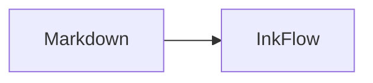

# 中文、Emoji 与 GFM ✍️

正文包含 **强调**、`inline code`、[相对链接](./other.md) 和脚注。[^note]

- [x] 已完成任务
- [ ] 未完成任务

| 功能 | 状态 |
| --- | :---: |
| 表格 | 可用 |

行内公式 $E = mc^2$。

$$
\int_0^1 x^2\,dx = \frac{1}{3}
$$

保留的原始 HTML

[^note]: 脚注内容。
